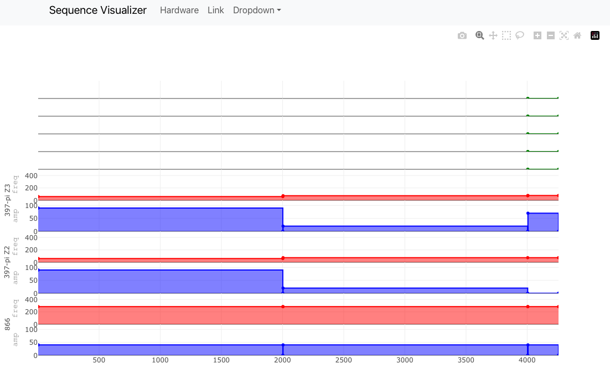

This is the sequence visualiser used to have a nice real-time visualisation of your pulse sequences created using the Experiment Library, PyCrystal and the ionpulse sequence generator.
For example, running the CoolDet from the Cryo setup looks like this:

# Getting Started

First git clone this repo in a suittable location.

Next thing you need it to install Node.js https://nodejs.org/en/download.

Then go into the repo and change the settings.json file such that the IP address and port match the one from your Library.

Then run `npm install` in the head of the repo. Once the installation is finished, use `npm start` to run the visualiser! By default this will run in

http://localhost:3000

# Usage

The visualiser connects to the Library using socket.io (https://socket.io/docs/v3).
The Experiment Library updates its hardware/scope_sequence attribute, and the visualiser gets notified about this update using the socket.
As soon as the socket is updated the new sequence is rendered.
Give it a try by using the `update_zedboard_sequence` in any of the experiments of your Library.

The Visualiser is based on plotly.js (https://plotly.com/javascript/) which gives us a great flexibility in its use.
Try zooming in, and out of your sequence.

The Visualiser will read your the Hardware/hardware_desciption attribute from your Library to know which RF and TTL channes are used, and will automatically enable this channels and hide the rest.
You can however use the "Channel configuration" button to decide which channels to show and hide.

Under the tab "Hardware" you can find the hardware description of your setup.

# Development

Once you have installed the visualiser, a pre-commit hook is added that uses `prettier` to check the code formatting before committing.
If you get an error from the pre-commit hook, run `./node_modules/.bin/prettier --write .`
